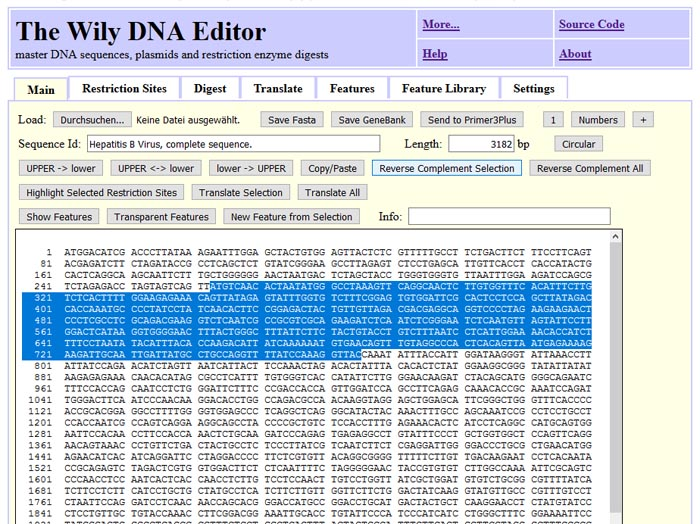
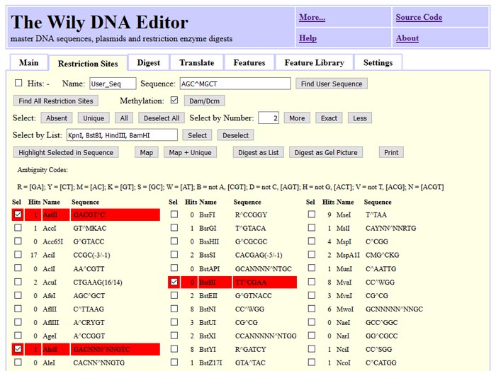
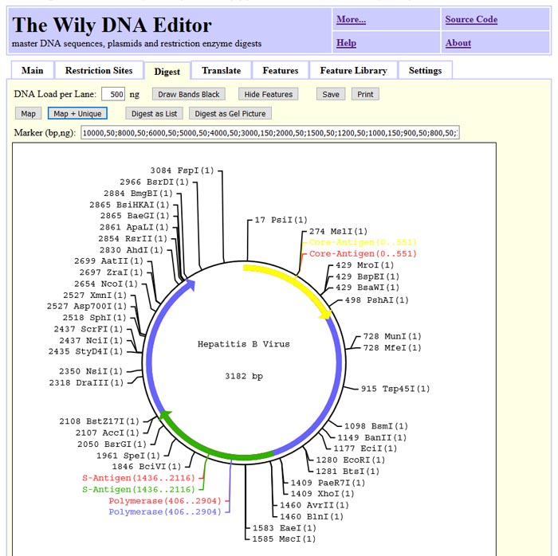
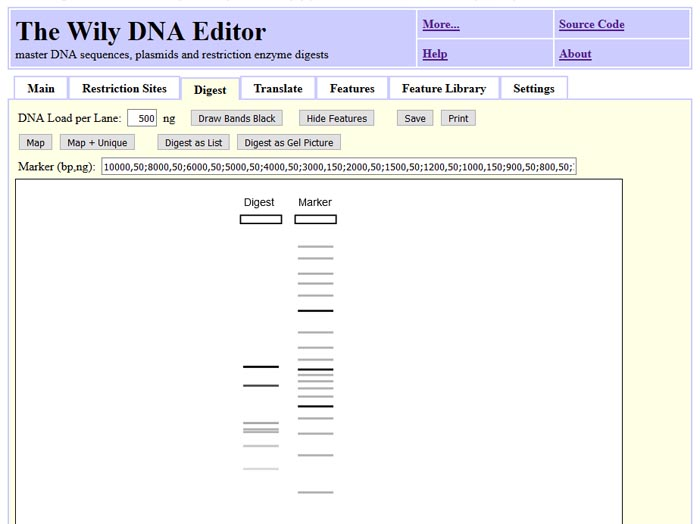
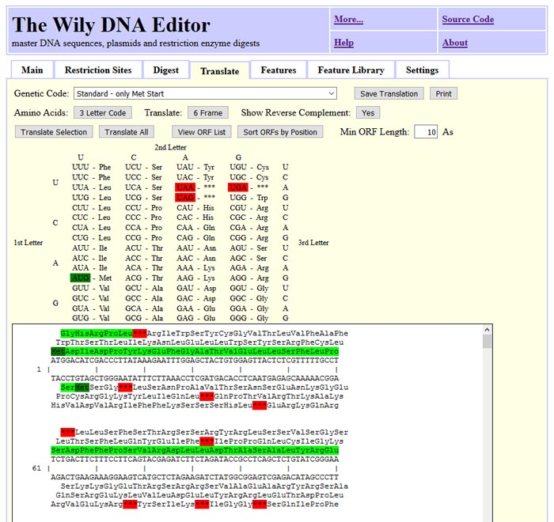
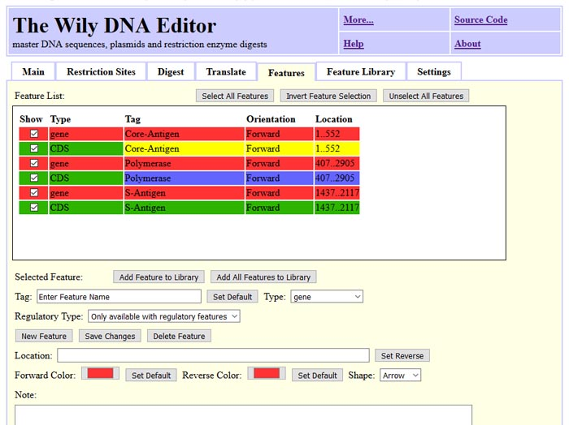

The Wily DNA Editor is an everyday lab tool for handling sequences
------------------------------------------------------------------

...running with pure JavaScript in your browser - no need to install anything.

Try it out:
-----------

[The Wily-DNA-Editor at wily-dna-editor.com](https://wily-dna-editor.com)

[The Wily-DNA-Editor at gear.embl.de/wily-dna-editor](http://gear.embl.de/wily-dna-editor)

Download Program and Source Code
--------------------------------

[Source code is available at https://github.com/gear-genomics/wily-dna-editor](https://github.com/gear-genomics/wily-dna-editor)

`git clone https://github.com/gear-genomics/wily-dna-editor.git`

The Wily DNA Editor can do basic DNA/RNA operations
---------------------------------------------------

Reverse-Complement DNA, remove non-IUPAC letters and change upper/lower case...

The Wily DNA Editor finds restriction sites
-------------------------------------------

Find restriction sites, select them and highlight the selected in sequence...

The Wily DNA Editor draws graphic maps
--------------------------------------

Draw restriction maps with or without features for linear an circular sequences...

The Wily DNA Editor visualize a digest as gel picture
-----------------------------------------------------

Simulate band indensity or draw all bands black...

The Wily DNA Editor translates DNA sequences
--------------------------------------------

Translate DNA in one, three or six frames...

The Wily DNA Editor handles genbank features
--------------------------------------------

Use features to annotate regions in the DNA...

The Wily DNA Editor gives you full conrol
-----------------------------------------

All calculation happens on your machine. You can load and save sequences in fasta and genbank format.
Pictures can be saved as html or svg files to disk and modified for publication...
